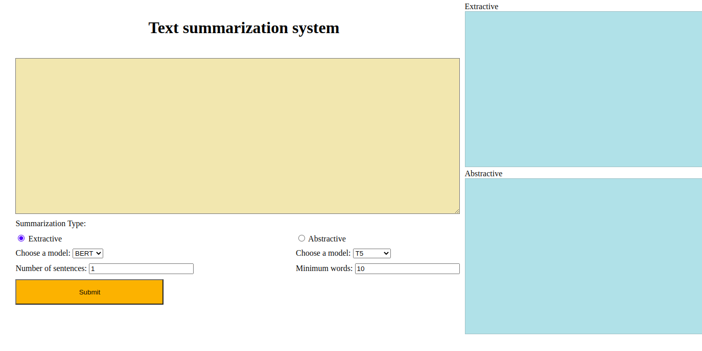

# Text_Sumamarization
Text Summarization via Hugging Face with Flask API

**Methods**

- [x] Extractive: BERT, GPT2, XLNET
- [x] Abstrative: BART, T5, Pegasus, LED

**Demo**

- [ ] For Extractive methods  number of sentences should be specified
- [ ] For Abstractive methods minimum number of words should be specified

